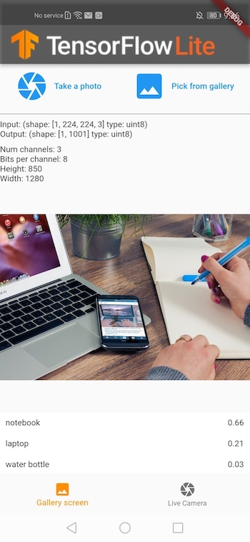
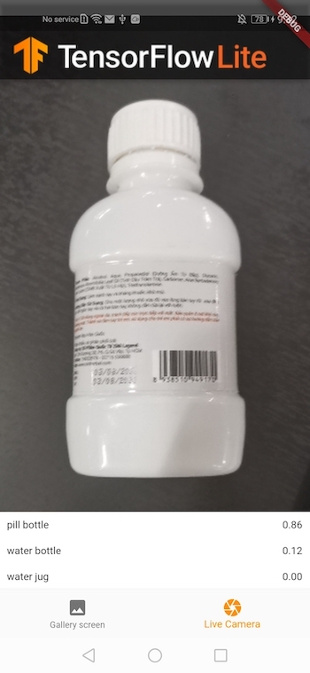

# ARN - Image classification MobileNet

This project is copy of the MobileNet image classification example from [tensorflow flutter-tflite](https://github.com/tensorflow/flutter-tflite/tree/main/example/image_classification_mobilenet).

## Flutter

This project uses the Flutter framework.

Please, follow [this documentation](https://docs.flutter.dev/get-started/install) to install Flutter with Android Studio for an Android application.

After installing everything make sure the installation works correctly by using the `flutter doctor` command. See: [Flutter doctor](https://docs.flutter.dev/get-started/install/windows/mobile#run-flutter-doctor).

## Android Studio Installation

You will need to download the Android Studio IDE. Instructions to do so are available [here](https://developer.android.com/studio/install).

## Test with MobileNet model and labels

To test the project with a pretrained mobilenet, you must first download the MobileNet TensorFlow Lite model and its corresponding labels. You can do this by running `sh ./scripts/download_model.sh` from the root folder of the repository.

## Using your own model weights

The code below can be used to create a .tfile weight file from your model weights. When you've exported the .tfile weights file, put this weight file and the labels.txt under TFLClassify/app/src/main/ml/.

```
import tensorflow as tf
from tflite_support.metadata_writers import image_classifier
from tflite_support.metadata_writers import writer_utils

# Task Library expects label files that are in the same format as the one below.
LABEL_FILE = "labels.txt"
SAVE_TO_PATH = "MyModel.tflite"

# Create the labels file
with open(LABEL_FILE, 'w') as label_file:
    for label in class_names: # /!\ class_names variable must contains the names of the labels you have.
        label_file.write("{}\n".format(label))

tflite_model = tf.lite.TFLiteConverter.from_keras_model(model).convert()

# Save the model.
with open(SAVE_TO_PATH, 'wb') as f:
    f.write(tflite_model)
    
ImageClassifierWriter = image_classifier.MetadataWriter

# Normalization parameters is required when reprocessing the image. It is
# optional if the image pixel values are in range of [0, 255] and the input
# tensor is quantized to uint8. See the introduction for normalization and
# quantization parameters below for more details.
# https://www.tensorflow.org/lite/convert/metadata#normalization_and_quantization_parameters)
INPUT_NORM_MEAN = 127.5
INPUT_NORM_STD = 127.5

# Create the metadata writer.
writer = ImageClassifierWriter.create_for_inference(
    writer_utils.load_file(SAVE_TO_PATH),
    [INPUT_NORM_MEAN],
    [INPUT_NORM_STD],
    [LABEL_FILE]
)

# Verify the metadata generated by metadata writer.
print(writer.get_metadata_json())

# Populate the metadata into the model.
writer_utils.save_file(writer.populate(), SAVE_TO_PATH)
```

## Testing your model on your smartphone

Instructions are given below, but check the following link for further informations: https://developer.android.com/studio/run/device

Note that in some rare cases you will need to install some drivers. Check Google documentation or the documentation from your smartphone's manufacturer.

If you don't have any compatible Android smartphone we can lend you one.

### Enabling USB debugging

You will need to have USB debugging enabled to be able to run the app on your smartphone by connecting it by USB.

1. To turn on developer mode: About phone -> tap on build number 7 times. 
2. Settings -> System -> Advanced -> Developer options -> USB debugging : activate this option

Connect the smartphone to your computer

1. Connect your smartphone to your computer with the cable
2. Allow USB debugging

Running the app on your device

In Android Studio you should now see your smartphone in the running devices selection
Testing your model on an emulator

**This is not necessary!** If you want to try with an emulator and your webcam you can do like so (on Android Studio) :

1. Devices list -> AVD Manager -> Create virtual device... -> Phone -> Pixel 8a -> Tiramisu, API 33 -> Show Advanced Settings -> Camera : select your webcam here. -> Finish

Troubleshooting :

1. Be sure to have enough space on the disk
2. Be sure to have the Android 13 SDK installed : Tools -> SDK Manager -> Android SDK -> Check "Android 13.0 ("Tiramisu")" -> Apply

Then you can run the code on the emulator.

## Still image mode

You have the option to either select an image from your device or capture a new
photo to classify.



## Live stream mode

The app will classify a continuous stream of image frames captured by the
camera.


